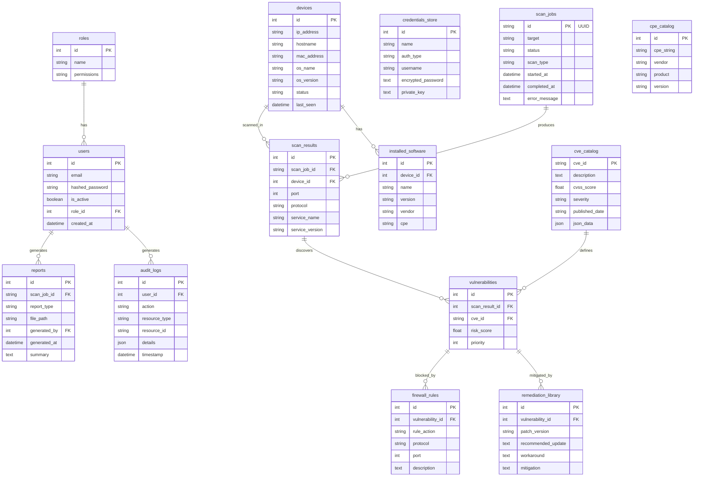

# VulnScope Entity Relationship Diagram

```mermaid
erDiagram
    users {
        int id PK
        string email
        string hashed_password
        boolean is_active
        int role_id FK
        datetime created_at
    }
    roles {
        int id PK
        string name
        string permissions
    }
    devices {
        int id PK
        string ip_address
        string hostname
        string mac_address
        string os_name
        string os_version
        string status
        datetime last_seen
    }
    installed_software {
        int id PK
        int device_id FK
        string name
        string version
        string vendor
        string cpe
    }
    credentials_store {
        int id PK
        string name
        string auth_type
        string username
        text encrypted_password
        text private_key
    }
    scan_jobs {
        string id PK "UUID"
        string target
        string status
        string scan_type
        datetime started_at
        datetime completed_at
        text error_message
    }
    scan_results {
        int id PK
        string scan_job_id FK
        int device_id FK
        int port
        string protocol
        string service_name
        string service_version
    }
    audit_logs {
        int id PK
        int user_id FK
        string action
        string resource_type
        string resource_id
        json details
        datetime timestamp
    }
    cve_catalog {
        string cve_id PK
        text description
        float cvss_score
        string severity
        string published_date
        json json_data
    }
    cpe_catalog {
        int id PK
        string cpe_string
        string vendor
        string product
        string version
    }
    vulnerabilities {
        int id PK
        int scan_result_id FK
        string cve_id FK
        float risk_score
        int priority
    }
    remediation_library {
        int id PK
        int vulnerability_id FK
        string patch_version
        text recommended_update
        text workaround
        text mitigation
    }
    firewall_rules {
        int id PK
        int vulnerability_id FK
        string rule_action
        string protocol
        int port
        text description
    }
    reports {
        int id PK
        string scan_job_id FK
        string report_type
        string file_path
        int generated_by FK
        datetime generated_at
        text summary
    }

    roles ||--o{ users : "has"
    users ||--o{ audit_logs : "generates"
    users ||--o{ reports : "generates"
    devices ||--o{ installed_software : "has"
    devices ||--o{ scan_results : "scanned_in"
    scan_jobs ||--o{ scan_results : "produces"
    scan_results ||--o{ vulnerabilities : "discovers"
    cve_catalog ||--o{ vulnerabilities : "defines"
    vulnerabilities ||--o{ remediation_library : "mitigated_by"
    vulnerabilities ||--o{ firewall_rules : "blocked_by"
```
